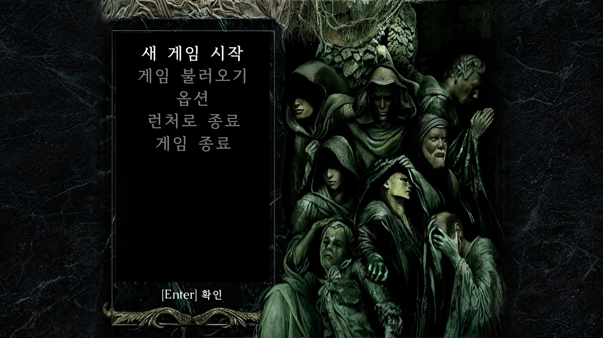
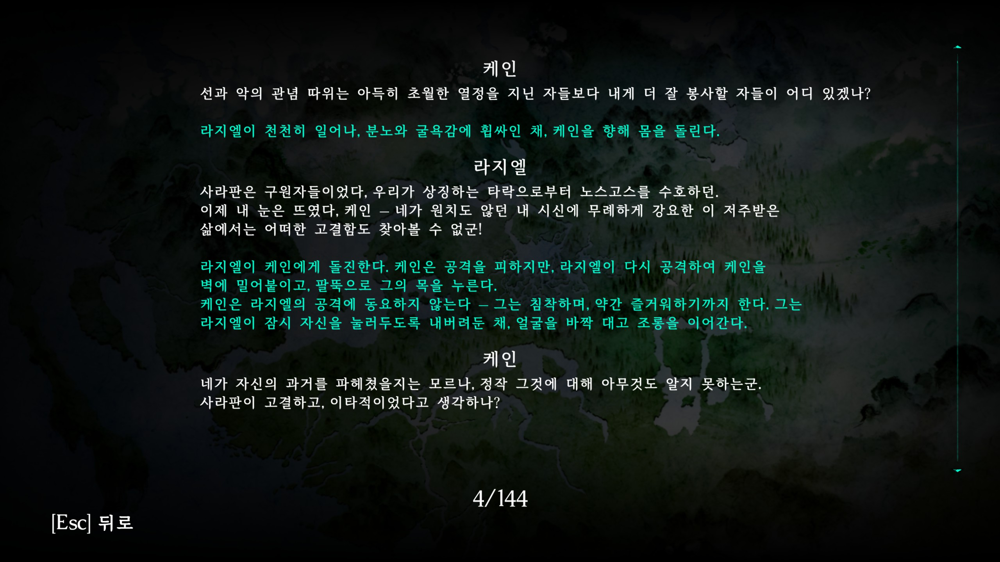
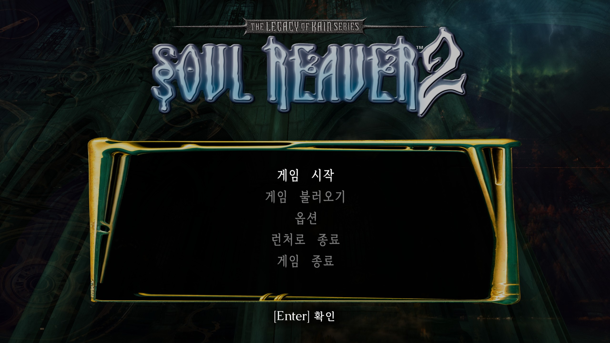
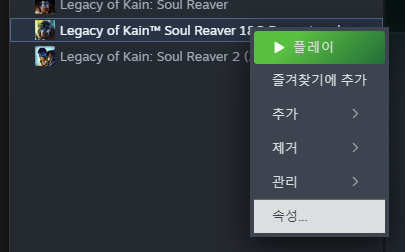
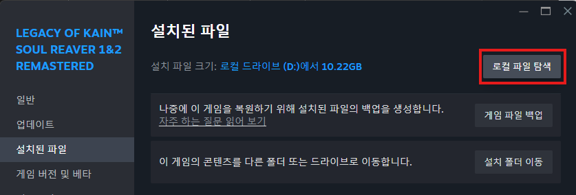
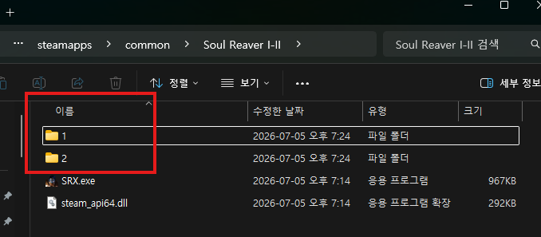
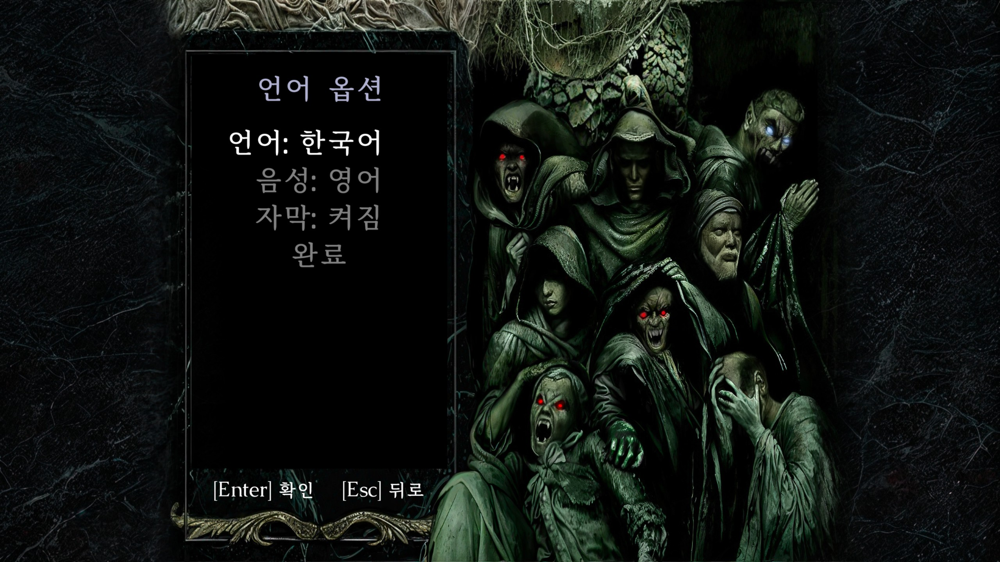
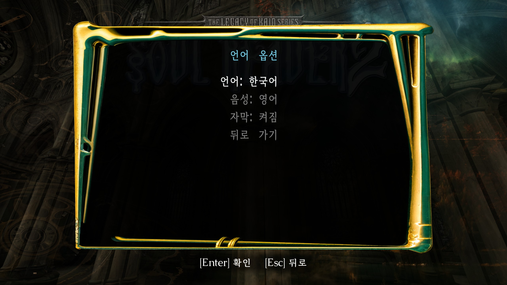
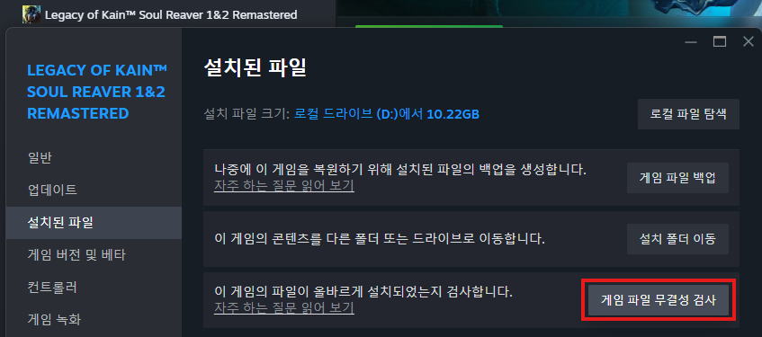

# Legacy of Kain: Soul Reaver 1&2 Remastered 한글 패치

소울 리버 1&2 리마스터 한글 패치입니다.

리소스 파일만 변경하여 게임 업데이트 후에도 별도로 패치를 다시 하지 않아도 됩니다.

연극적, 희곡적인 대사가 많아 최대한 원문의 느낌을 살리려 노력했습니다.

다만, 느낌을 살리기 위해 일부 직역하거나 문장 순서를 억지로 유지한 부분도 있으니,

어색하거나 개선할 점은 Issue에 의견을 남겨주시면 최대한 반영하겠습니다.

어둠의 연대기에서 줄이 벗어나는건, 한글과 영어 폭 문제로 길어서 잘리는 부분만 제거하였습니다.

차후 여유가 있을 때 수정하겠습니다.

**[다운로드 및 안내 페이지](https://devwock.github.io/lok-sr-1-2-remastered-korean/)** · [설치 방법 보기](#설치-방법)

## 스크린샷

| | |
| --- | --- |
|  |  |
|  |  |
|  |  |
|  |  |

## 설치 방법

### 1. 게임 폴더 확인

Steam에서 **Legacy of Kain™ Soul Reaver 1&2 Remastered**를 오른쪽 클릭한 뒤 **속성 - 설치된 파일 - 로컬 파일 탐색**을 눌러 파일 위치를 엽니다.

| | |
| --- | --- |
|  |  |

### 2. 파일 덮어쓰기

다운로드한 압축 파일을 열어 폴더를 기존 파일에 덮어씁니다.

### 3. 언어 선택

소울리버 1 혹은 2의 언어 설정에서 **중국어**를 선택하면 한글 패치가 적용됩니다.

| | |
| --- | --- |
|  |  |

## 원본으로 복원하기

Steam에서 **Legacy of Kain™ Soul Reaver 1&2 Remastered**를 오른쪽 클릭한 뒤 **속성 - 설치된 파일 - 게임 파일 무결성 검사**를 실행하세요.

| | |
| --- | --- |
|  |  |

## 릴리즈 노트

| 공개일 | 변경 내역 |
| --- | --- |
| 2026-09-06 | 최초 공개 |

## 개선할 점을 알려주세요.

어색한 표현, 오역, 버그, 제안을 남겨주시면 확인 후 반영하겠습니다.

- [GitHub Issue 열기](https://github.com/devwock/lok-sr-1-2-remastered-korean/issues)

---

Unofficial Korean translation project for Legacy of Kain: Soul Reaver 1&2 Remastered.
